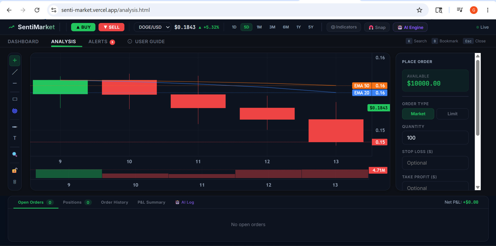
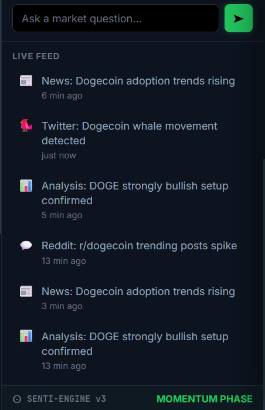
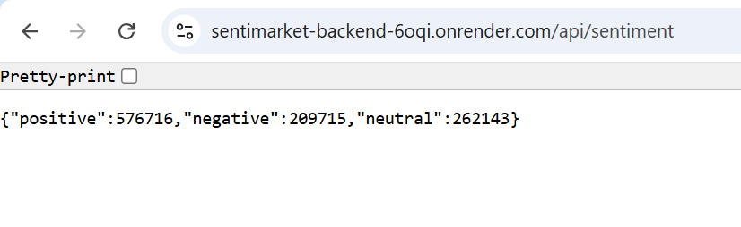

# SentiMarket 🚀

## Cryptocurrency Sentiment Analysis Dashboard

SentiMarket is a full-stack web application for analyzing and visualizing cryptocurrency sentiment through an interactive dashboard. It provides sentiment insights, market-related data, charts, analytics, and a live feed through a responsive web interface.

The application uses a JavaScript frontend, Node.js and Express.js backend, and MySQL database hosted on AWS RDS. The frontend and backend are deployed separately using Vercel and Render.

---

## ✨ Features

- 📊 Interactive cryptocurrency sentiment dashboard
- 📈 Sentiment charts and analytics
- 📰 Latest market feed
- 📋 Sentiment summary and statistics
- 🔄 Automatic data refresh
- ⚡ Live backend data fetching
- 🔗 REST API-based frontend-backend communication
- 🗄️ AWS RDS MySQL database integration
- ☁️ Cloud deployment using Vercel and Render
- 📱 Responsive user interface

---

## 🛠️ Tech Stack

### Frontend

- HTML5
- CSS3
- JavaScript

### Backend

- Node.js
- Express.js
- REST APIs

### Database

- MySQL
- AWS RDS
- MySQL Workbench

### Deployment

- Vercel — Frontend
- Render — Backend

### Development Tools

- Git
- GitHub
- VS Code
- MySQL Workbench

---

## 🏗️ Architecture

```text
                         ┌─────────────────┐
                         │      User       │
                         └────────┬────────┘
                                  │
                                  ▼
                    ┌─────────────────────────┐
                    │    Vercel Frontend      │
                    │    HTML/CSS/JavaScript  │
                    └────────────┬────────────┘
                                 │
                            REST API
                                 │
                                 ▼
                    ┌─────────────────────────┐
                    │     Render Backend      │
                    │     Node.js + Express   │
                    └────────────┬────────────┘
                                 │
                         Database Queries
                                 │
                                 ▼
                    ┌─────────────────────────┐
                    │       AWS RDS            │
                    │         MySQL            │
                    └─────────────────────────┘
```

---

## 🌐 Live Demo

### Frontend

**SentiMarket Dashboard:**  
https://senti-market.vercel.app/

### Backend API

**Sentiment API:**  
https://sentimarket-backend-6oqi.onrender.com/api/sentiment

### Source Code

**GitHub Repository:**  
https://github.com/Akshitha363/SentiMarket

---

## 📸 Screenshots

### Dashboard


### Analytics & Charts



### Market Feed



### REST API



### AWS RDS Database


### MySQL Workbench


---

## 📂 Project Structure

```text
SentiMarket/
│
├── backend/
│   ├── server.js
│   ├── package.json
│   └── ...
│
├── frontend/
│   ├── index.html
│   ├── style.css
│   ├── app.js
│   └── ...
│
├── screenshots/
│   ├── api.png
│   ├── aws rds database.png
│   ├── charts.png
│   ├── dashboard.png
│   ├── database.png
│   ├── feed.png
│   ├── github.png
│   ├── render.png
│   ├── senti dashboard.png
│   └── senti sql workbench.png
│
├── README.md
└── .gitignore
```

---

## ⚙️ Installation & Setup

### 1. Clone the Repository

```bash
git clone https://github.com/Akshitha363/SentiMarket.git
```

### 2. Navigate to the Project

```bash
cd SentiMarket
```

### 3. Install Backend Dependencies

```bash
cd backend
npm install
```

### 4. Configure Environment Variables

Create the required environment configuration file inside the `backend` directory.

Add the database and other configuration values required by the application.

> Do not commit passwords, API keys, database credentials, or other sensitive information to GitHub.

### 5. Start the Backend

```bash
node server.js
```

The backend will start on the configured local port.

### 6. Run the Frontend

Open `frontend/index.html` in a browser or use a development extension such as Live Server.

---

## 📡 API Endpoints

| Method | Endpoint | Description |
|---|---|---|
| GET | `/api/sentiment` | Retrieve sentiment analysis data |
| GET | `/api/data` | Retrieve available market and sentiment data |
| GET | `/api/latest` | Retrieve the latest available feed |
| GET | `/api/summary` | Retrieve aggregated summary statistics |

### Example Request

```http
GET /api/sentiment
```

The frontend uses these REST API endpoints to retrieve and display data in the dashboard.

---

## 🗄️ Database

SentiMarket uses **MySQL hosted on AWS RDS** for cloud-based database storage.

### `sentiments` Table

| Column | Data Type | Description |
|---|---|---|
| `id` | INT | Unique record identifier |
| `user_name` | VARCHAR(255) | Associated username |
| `text` | TEXT | Sentiment-related text |
| `date` | VARCHAR(50) | Record date |
| `hashtags` | TEXT | Associated hashtags |

---

## ☁️ Deployment

### Frontend

The frontend is deployed on **Vercel**.

### Backend

The Node.js and Express.js backend is deployed on **Render**.

### Database

The application uses **AWS RDS MySQL** for cloud database storage.

### Deployment Flow

```text
Vercel
   │
   ▼
Frontend
   │
   │ REST API Requests
   ▼
Render
   │
   ▼
Node.js + Express
   │
   │ Database Queries
   ▼
AWS RDS MySQL
```

---

## 🔐 Security Considerations

- Database credentials are managed through environment configuration.
- Sensitive configuration should not be committed to version control.
- `.gitignore` is used to prevent accidental commits of local configuration files.
- Frontend and backend are separated into independent services.
- API-based communication is used between the frontend and backend.

---

## 🚀 Future Enhancements

- Integrate additional real-time social media data sources
- Add machine-learning-based sentiment prediction
- Introduce user authentication and personalized dashboards
- Add advanced cryptocurrency market forecasting
- Develop a mobile application
- Add additional analytics and visualization features
- Improve automated data processing and refresh mechanisms

---

## 📚 Learning Outcomes

This project provided hands-on experience with:

- Full-stack web application development
- REST API development
- Node.js and Express.js
- MySQL database integration
- AWS RDS
- Frontend-backend communication
- Data visualization
- Cloud deployment
- Git and GitHub
- Environment-based configuration

---

## 👩‍💻 Author

**Akshitha**

B.Tech Information Technology Student | Aspiring Software Engineer

**GitHub:**  
https://github.com/Akshitha363
